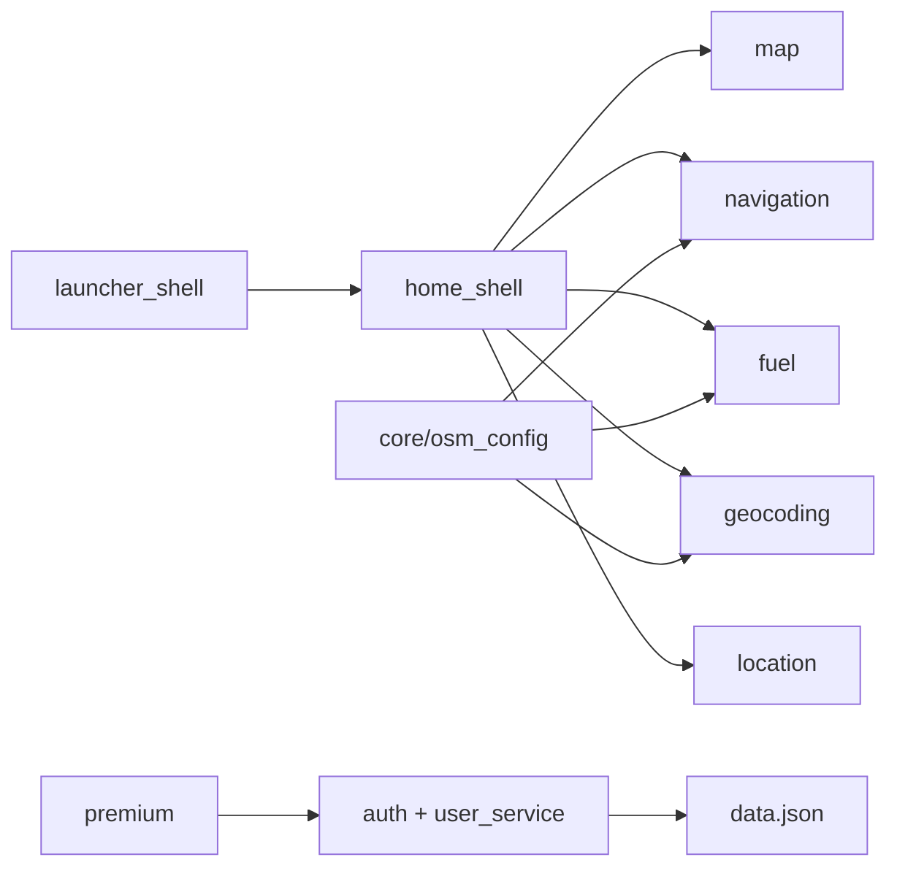

# PROJECT_ANALYSIS.md — Phân tích kỹ thuật Fuel Tracker Pro

> Tài liệu tổng quan kỹ thuật dựa trên quét toàn bộ source code trong repo `Mobiapp`.  
> Không bao gồm thông tin suy đoán — chỉ ghi nhận những gì tồn tại trong code.

**Ngày phân tích:** 2026-06-24  
**Package:** `fuel_tracker_app` v2.0.0+1

### Đội ngũ & ownership module

| Thành viên | Vai trò | Module chính phụ trách |
|---|---|---|
| **Hoàng** | Lead Frontend | `shell`, `home_ios`, `map`/`navigation`/`geocoding` (UI), `auth`/`premium` (UI), `fuel` (presentation), `shared/widgets` |
| **Đăng Khoa** | Lead Backend | `navigation`/`geocoding`/`location` (services), `fuel/data/services`, `auth/services`, `core/network`, `core/config` |
| **Khánh** | Data Engineer | `auth/data`, `auth/models`, `assets/data/data.json`, `NavigationSessionStore`, SharedPreferences |
| **Nguyên** | AI Engineer | `fuel/intelligence/**`, `FuelIntelligenceViewModel`, `weather_service`, `elevation_service` |
| **No** | DevOps & QA | `test/`, `scripts/`, platform builds, CI/CD (cần tạo) |

RACI đầy đủ: [TEAM_STRUCTURE.md](TEAM_STRUCTURE.md)

---

## 1. Phân tích tổng thể dự án

### 1.1 Quy mô dự án

| Chỉ số | Giá trị |
|---|---|
| Tổng file (không tính `.git`, `build`, `.dart_tool`) | ~800 |
| File Dart | 196 |
| Dòng code Dart | ~31.566 |
| Feature modules (`lib/features/`) | 9 (shell, home_ios, map, geocoding, navigation, location, fuel, auth, premium, group3_demo) |
| Unit test files | 11 |
| Nền tảng hỗ trợ | Android, iOS, Windows, Web (có runner/config) |
| Backend server | **Không có** |
| Database SQL | **Không có** |

**Phân loại:** Ứng dụng Flutter client-heavy, tích hợp nhiều API OSM bên thứ ba, có lớp demo auth/premium local và launcher iOS giả lập.

**File lớn nhất (rủi ro maintainability):**

| File | Dòng |
|---|---|
| `lib/features/shell/screens/home_shell.dart` | ~2.539 |
| `lib/shared/screens/profile_settings_sheet.dart` | ~1.613 |
| `lib/shared/widgets/iphone_17_pro_max_frame.dart` | ~993 |
| `lib/features/fuel/presentation/screens/fuel_intelligence_screen.dart` | ~924 |
| `lib/features/fuel/presentation/viewmodels/fuel_intelligence_view_model.dart` | ~909 |
| `lib/core/theme/luxury_widgets.dart` | ~473 |

### 1.2 Điểm mạnh

1. **Kiến trúc feature-based rõ ràng** — domain tách: map, geocoding, navigation, location, fuel; shell orchestration tập trung tại `HomeShell`.
2. **Không phụ thuộc API key** cho stack OSM chính (Nominatim, OSRM, Overpass, Open-Meteo).
3. **HTTP layer có discipline** — `OsmHttpClient` với timeout, retry, rate limit Nominatim (`lib/core/network/osm_http.dart`).
4. **Geocoding Việt Nam** — `VietnameseTextUtils` hỗ trợ tìm có/không dấu; `countrycodes=vn`.
5. **Navigation robust** — off-route detection, reroute cooldown, session restore 12h (`gps_tracking_policy.dart`, `navigation_session_store.dart`).
6. **Fuel intelligence modular** — engines tách: prediction, simulation, consumption, warnings, driving behavior.
7. **Dual state management có chủ đích** — Provider cho services, Riverpod cho launcher iOS.
8. **Test coverage cho utils quan trọng** — polyline, route progress, nominatim, OSRM parser, TTL cache, GPS policy.
9. **Dev experience Web LAN** — scripts PowerShell, CORS proxy config, debug overlay.
10. **UI polish** — iOS launcher simulation, cinematic HUD, spring animations, iPhone frame desktop.

### 1.3 Điểm yếu

1. **God widget** — `home_shell.dart` ~2.500 dòng, khó test và review.
2. **Không có backend** — auth/password plaintext JSON; không production-ready cho multi-user thật.
3. **Premium features nhiều enum chưa implement** — PDF export, Excel, AI assistant, cloud sync chỉ có tên.
4. **Payment & social login là demo** — không gateway, không OAuth SDK.
5. **Trip history không tự động** — dữ liệu seed tĩnh, không gắn navigation lifecycle.
6. **Dual state management** — Provider + Riverpod tăng cognitive load cho dev mới.
7. **Elevation service tắt** — `openElevationLookupUrl` rỗng, model tiêu hao thiếu dữ liệu độ cao thật.
8. **Không CI/CD** — không GitHub Actions, không Docker.
9. **Password storage** — plaintext trong JSON (ghi rõ demo trong `change_password_screen.dart`).
10. **Một số UI dead-end** — `onPressed: null` trên Manage Membership.

### 1.4 Technical Debt

| Hạng mục | Mô tả | Mức |
|---|---|---|
| Monolithic HomeShell | Cần tách viewmodel / controllers | Cao |
| Auth security | Plaintext password, mock OTP | Cao |
| Premium feature gap | 14 enum, chỉ ~4 có guard thực tế | Trung bình |
| File size | 5 file > 900 dòng | Trung bình |
| Elevation integration | URL chưa cấu hình | Thấp |
| Android Kotlin drawer | Một phần UI native, phần lớn Flutter — dual stack | Thấp |
| Test gap | Không test widget/integration cho shell, auth flows | Trung bình |
| Documentation drift | README cũ đã được cập nhật lần này | Đã xử lý |

### 1.5 Các module quan trọng

| Module | Vai trò | Độ quan trọng |
|---|---|---|
| `features/shell` | Orchestration toàn app map | **Critical** |
| `features/navigation` | OSRM, HUD, session | **Critical** |
| `features/fuel` | Core value proposition | **Critical** |
| `features/location` | GPS foundation | **Critical** |
| `features/geocoding` | Search UX | **High** |
| `features/map` | Visual map | **High** |
| `features/auth` | User session local | **Medium** (demo) |
| `features/premium` | Monetization demo | **Medium** |
| `features/home_ios` | Entry UX / branding | **High** (first screen) |
| `features/group3_demo` | Education demo | **Low** (isolated) |
| `core/` | Config, HTTP, theme | **Critical** infrastructure |
| `shared/` | Cross-cutting services | **High** |

---

## 2. Thống kê code

### 2.1 Tổng số file

| Loại | Số lượng (ước tính từ scan) |
|---|---|
| Tất cả (excl. build/git) | ~800 |
| `.dart` | 196 |
| `.md` | ~39 (gồm docs, README) |
| `.ps1` scripts | 11 |
| Test `.dart` | 11 |

### 2.2 Tổng số dòng code

| Ngôn ngữ | Files | Dòng |
|---|---|---|
| Dart (`lib/` + `test/`) | 196 | ~31.566 |
| Kotlin (Android) | ~5 | < 500 (ước tính) |
| YAML/JSON config | ~10 | < 300 |

### 2.3 Ngôn ngữ sử dụng

- **Chính:** Dart (Flutter)
- **Phụ:** Kotlin (Android MainActivity, drawer UI), C++ (Windows runner), HTML/JS (Web embed)
- **Script:** PowerShell, Shell

### 2.4 File lớn nhất (Top 10 Dart)

| # | File | Dòng |
|---|---|---|
| 1 | `home_shell.dart` | 2.539 |
| 2 | `profile_settings_sheet.dart` | 1.613 |
| 3 | `iphone_17_pro_max_frame.dart` | 993 |
| 4 | `fuel_intelligence_screen.dart` | 924 |
| 5 | `fuel_intelligence_view_model.dart` | 909 |
| 6 | `navigation_hud.dart` | 902 |
| 7 | `login_premium_widgets.dart` | 768 |
| 8 | `map_panel.dart` | 729 |
| 9 | `user_session_service.dart` | 549 |
| 10 | `ios_app_icons.dart` | 498 |

### 2.5 Thư viện chính (dependencies)

| Package | Version | Vai trò |
|---|---|---|
| flutter | SDK | Framework |
| provider | ^6.1.2 | Service state |
| flutter_riverpod | ^3.3.1 | Launcher state |
| flutter_map | ^7.0.2 | Bản đồ |
| geolocator | ^13.0.2 | GPS |
| http | ^1.2.2 | HTTP client |
| shared_preferences | ^2.5.5 | Local prefs |
| flutter_local_notifications | ^17.2.4 | Notifications |
| flutter_animate | ^4.5.2 | Animation |
| google_fonts | ^6.2.1 | Typography |
| image_picker | ^1.1.2 | Avatar |
| sensors_plus | ^7.0.0 | Driving behavior |

---

## 3. Đánh giá chất lượng

> Thang điểm 1–10 dựa trên code hiện có, không so sánh với tiêu chuẩn enterprise chưa implement.

| Hạng mục | Điểm | Nhận xét |
|---|---|---|
| **Security** | **3/10** | Password plaintext JSON; mock OTP; không encryption; social login chưa cấu hình. Author guard chỉ bảo vệ credit tác giả. |
| **Performance** | **7/10** | Cache TTL geocoding/Overpass; OSRM request dedup; GPS filter; nhưng HomeShell rebuild nặng, file lớn. |
| **SEO** | **2/10** | App Flutter — Web build có `web/manifest.json` nhưng không có SSR/SEO strategy trong code. Không áp dụng cho mobile-first. |
| **Accessibility** | **4/10** | Một số widget có semantics cơ bản; UI phức tạp (blur premium, gesture layers) chưa thấy audit a11y systematic. |
| **Maintainability** | **5/10** | Feature structure tốt; nhưng god files, dual state libs, demo/production code trộn làm tăng chi phí bảo trì. |

### Chi tiết Security

- ✅ User-Agent Nominatim đúng policy
- ✅ Rate limit / debounce search
- ❌ Không hash password
- ❌ Không certificate pinning
- ❌ Không secrets management (không cần API key — trade-off)

### Chi tiết Performance

- ✅ `TtlCache` cho geocoding
- ✅ Overpass cache 8 phút, invalidate khi di chuyển >800m
- ✅ `NavigationPerformance` throttle constants
- ⚠️ `home_shell.dart` single StatefulWidget quá lớn

### Chi tiết Maintainability

- ✅ Package imports nhất quán `package:fuel_tracker_app/...`
- ✅ Separation geocoding / navigation / fuel services
- ❌ Thiếu integration tests
- ❌ Premium enum vs implementation mismatch

---

## 4. Đề xuất nâng cấp

### 4.1 Quick Wins (1–2 tuần)

| # | Đề xuất | Lý do |
|---|---|---|
| 1 | Tách `HomeShell` thành `HomeShellController` + smaller widgets | Giảm file 2500 dòng |
| 2 | Bật `Manage Membership` → navigate `PremiumScreen` | Fix `onPressed: null` |
| 3 | Ghi trip history khi navigation kết thúc | `UserService.addTripHistory` đã có |
| 4 | Cấu hình `openElevationLookupUrl` hoặc xóa dead code | Elevation hiện no-op |
| 5 | Thêm `flutter analyze` vào script local / pre-commit | 20 warnings hiện có (IDE) |
| 6 | Document dart-define cho social login trong README | Dev onboarding |

### 4.2 Medium Improvements (1–2 tháng)

| # | Đề xuất | Lý do |
|---|---|---|
| 1 | Hash password (bcrypt/argon2) + salt | Security baseline |
| 2 | Tách Riverpod hoặc Provider — chọn một cho toàn app | Giảm complexity |
| 3 | Widget tests cho Login, PremiumGuard, MapSearchBar | Regression safety |
| 4 | Implement hoặc xóa Premium features chưa dùng | Tránh misleading UX |
| 5 | GitHub Actions: `flutter test` + `flutter analyze` | CI cơ bản |
| 6 | Self-host OSRM / Nominatim cho production | Giảm phụ thuộc public demo API |
| 7 | Refactor `profile_settings_sheet.dart` (~1600 dòng) | Maintainability |

### 4.3 Major Improvements (3–6 tháng)

| # | Đề xuất | Lý do |
|---|---|---|
| 1 | Backend thật (Firebase / Supabase / custom API) | Auth, sync, payment production |
| 2 | Payment gateway (Momo API, Stripe) | Monetization thật |
| 3 | Real-time trip recording + analytics pipeline | Core product value |
| 4 | Offline maps / route cache | UX khi mất mạng |
| 5 | AI assistant (nếu cần) — LLM API + RAG trên trip data | Hiện chỉ có enum |
| 6 | Integration test E2E (patrol / integration_test) | Shell flow coverage |
| 7 | Modularization — tách `fuel_intelligence` thành package | Team scaling |

---

## 5. Ma trận rủi ro

| Rủi ro | Xác suất | Tác động | Giảm thiểu |
|---|---|---|---|
| OSRM public API rate limit / downtime | Cao | Cao | Self-host OSRM |
| Nominatim 429 | Trung bình | Trung bình | Đã có rate limit; cần cache mạnh hơn |
| Data loss JSON local | Trung bình | Cao | Backup + cloud sync |
| HomeShell regression | Cao | Cao | Tách module + tests |
| Security audit fail | Cao | Cao | Hash password, remove demo OTP |

---

## 6. Test coverage hiện có

| File test | Phạm vi |
|---|---|
| `polyline_utils_test.dart` | Polyline math |
| `route_progress_utils_test.dart` | Route progress |
| `route_snap_warning_test.dart` | Snap warning |
| `osrm_routing_service_test.dart` | OSRM parsing |
| `nominatim_geocoding_service_test.dart` | Geocoding |
| `osm_http_test.dart` | HTTP client |
| `ttl_cache_test.dart` | Cache |
| `gps_tracking_test.dart` | GPS policy |
| `fuel_service_test.dart` | Fuel consumption |
| `vietnamese_text_utils_test.dart` | Search variants |
| `author_integrity_test.dart` | Author guard |

**Không có:** widget test, integration test, golden test.

---

## 7. Phân công đề xuất theo technical debt

| Hạng mục | Owner đề xuất | Lý do |
|---|---|---|
| Tách `home_shell.dart` | **Hoàng** + **Đăng Khoa** | UI vs service logic |
| Hash password | **Khánh** + **Đăng Khoa** | Schema + auth service |
| CI/CD GitHub Actions | **No** | Greenfield |
| Bật elevation / tune prediction | **Nguyên** | Intelligence pipeline |
| Trip history tự động | **Đăng Khoa** + **Khánh** | Service ghi + schema |
| Fix `onPressed: null` Premium | **Hoàng** | UI bug |

---

## 8. Kết luận

Fuel Tracker Pro là **ứng dụng Flutter client phức tạp** với stack bản đồ/navigation/fuel hoàn chỉnh ở mức prototype–production hybrid. Điểm mạnh nằm ở tích hợp OSM và UX launcher; điểm yếu chính là **auth/premium demo**, **god files**, và **thiếu backend/CI**.

Team 5 người (Hoàng, Đăng Khoa, Khánh, Nguyên, No) có thể song song hóa theo lớp UI / services / data / intelligence / QA — chi tiết trong [TEAM_STRUCTURE.md](TEAM_STRUCTURE.md).

Phù hợp cho: demo sản phẩm, học Flutter feature architecture, POC navigation + fuel.  
Cần thêm work trước khi production commercial: security, payment, backend, CI/CD.

---

*Phân tích dựa trên source tại `D:\Mobiapp` — 196 file Dart, ~31.566 LOC — team: Hoàng, Đăng Khoa, Khánh, Nguyên, No.*
