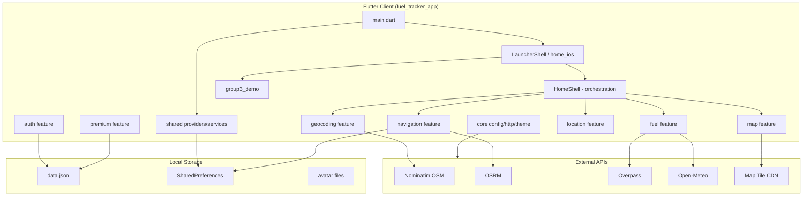

# Fuel Tracker Pro

Ứng dụng Flutter đa nền tảng (Android / iOS / Windows / Web) theo dõi GPS realtime, bản đồ OpenStreetMap, quản lý nhiên liệu và chỉ đường tới trạm xăng — **không cần API key** cho các dịch vụ OSM.

**Tác giả:** Lữ Minh Hoàng  
**Package:** `fuel_tracker_app`  
**Phiên bản:** `2.0.0+1` (`pubspec.yaml`)

### Đội ngũ phát triển

| Thành viên | Vai trò |
|---|---|
| **Hoàng** | Lead Frontend |
| **Đăng Khoa** | Lead Backend |
| **Khánh** | Data Engineer |
| **Nguyên** | AI Engineer |
| **No** | DevOps & QA |

Chi tiết phân công, RACI và onboarding: [TEAM_STRUCTURE.md](TEAM_STRUCTURE.md)

---

## 1. Tổng quan dự án

### Tên dự án

- **Tên hiển thị:** Fuel Tracker Pro (`lib/main.dart` — `title: 'Fuel Tracker Pro'`)
- **Tên package:** `fuel_tracker_app` (`pubspec.yaml`)

### Mục đích hệ thống

Ứng dụng client-side giúp người dùng:

1. Theo dõi vị trí GPS realtime trên bản đồ OSM.
2. Tìm kiếm địa điểm (Nominatim, ưu tiên Việt Nam) và tính tuyến lái xe (OSRM).
3. Quản lý mức nhiên liệu, cảnh báo xăng thấp, gợi ý trạm xăng (Overpass / Nominatim).
4. Phân tích tiêu hao nhiên liệu trên tuyến (engine local trong `lib/features/fuel/intelligence/`).
5. Mô phỏng launcher iOS và demo UI học tập (Group3 Food Demo).

**Không có backend server riêng** — toàn bộ logic chạy trên thiết bị; dữ liệu người dùng lưu local (`data.json` + SharedPreferences).

### Đối tượng sử dụng

- Người lái xe / xe máy cần theo dõi nhiên liệu và chỉ đường tới trạm xăng.
- Người dùng demo tài khoản local (đăng ký / đăng nhập trong app).
- Người học Flutter (module Group3 demo widget).

### Công nghệ sử dụng

| Thành phần | Công nghệ |
|---|---|
| Framework | Flutter SDK `>=3.3.0 <4.0.0` |
| Bản đồ | `flutter_map` ^7.0.2 + Carto Dark Matter tiles |
| GPS | `geolocator` ^13.0.2 |
| Geocoding | Nominatim (`countrycodes=vn`, `accept-language=vi`) |
| Cây xăng | Overpass API (`amenity=fuel`) |
| Tuyến đường | OSRM (`router.project-osrm.org`) |
| Thời tiết | Open-Meteo API |
| State | `provider` ^6.1.2 + `flutter_riverpod` ^3.3.1 |
| Lưu trữ local | `shared_preferences`, JSON file, avatar file |
| Thông báo | `flutter_local_notifications` ^17.2.4 |
| Animation | `flutter_map_animations`, `flutter_animate` |

---

## 2. Chức năng hiện có

> Mỗi mục dưới đây có dẫn chứng từ source code. Các tính năng ghi **(demo / chưa hoàn thiện)** được đánh dấu rõ.

### 2.1 Launcher iOS giả

| | |
|---|---|
| **Mục đích** | Mô phỏng màn hình home iPhone: lưới icon, dock, wallpaper, gesture mở Control Center / Notification Center / Spotlight |
| **Luồng** | `main.dart` → `LauncherShell` → `IosHomeScreen` → tap icon → `AppLaunchOverlay` → mở app thật |
| **File** | `lib/features/home_ios/presentation/launcher_shell.dart`, `pages/ios_home_screen.dart`, `widgets/app_launch_overlay.dart`, `widgets/dynamic_island_overlay.dart`, `widgets/control_center_overlay.dart`, `widgets/notification_center_overlay.dart`, `widgets/spotlight_overlay.dart` |

**App thật trong catalog** (`lib/features/home_ios/data/ios_app_catalog.dart`):

- `fuel_tracker` → Fuel Tracker (`HomeScreen` / `HomeShell`)
- `group3_food_demo` → Food Demo (`Group3FoodDemoScreen`)
- Các icon còn lại (Maps, Weather, …) là **placeholder UI**, không mở app chức năng.

### 2.2 Bản đồ realtime (Map)

| | |
|---|---|
| **Mục đích** | Hiển thị bản đồ OSM, vị trí người dùng, cluster trạm xăng, polyline tuyến, pin đích, vòng range nhiên liệu |
| **Luồng** | `HomeShell` truyền props → `MapPanel` render layers |
| **File** | `lib/features/map/presentation/widgets/map_panel.dart`, `lib/features/map/core/map_style.dart` |

**Style bản đồ hỗ trợ:** dark, standard, satellite, terrain (`MapVisualStyle` enum).

### 2.3 GPS & theo dõi vị trí

| | |
|---|---|
| **Mục đích** | Stream vị trí, bearing, tốc độ; lọc nhiễu GPS; tích lũy quãng đường để trừ nhiên liệu |
| **Luồng** | `LocationService.startListening()` → `HomeShell._onLocationChanged` → cập nhật map / navigation / fuel |
| **File** | `lib/features/location/data/services/location_service.dart`, `lib/features/location/core/gps_position_filter.dart`, `lib/features/location/core/gps_tracking_policy.dart` |

### 2.4 Tìm kiếm địa điểm (Geocoding)

| | |
|---|---|
| **Mục đích** | Tìm địa chỉ tiếng Việt (có/không dấu), reverse geocoding, resolve tọa độ cho navigation |
| **Luồng** | `MapSearchBar` debounce → `NominatimGeocodingService.search` → `PlaceSuggestionsPanel` → chọn → `HomeShell._navigateToPlace` |
| **File** | `lib/features/geocoding/data/services/nominatim_geocoding_service.dart`, `presentation/widgets/map_search_bar.dart`, `presentation/widgets/place_suggestions_panel.dart`, `core/vietnamese_text_utils.dart` |

### 2.5 Chỉ đường & Navigation (OSRM)

| | |
|---|---|
| **Mục đích** | Tính tuyến lái xe, hiển thị HUD (km, ETA), phát hiện lệch tuyến, reroute, khôi phục phiên |
| **Luồng** | Chọn đích → `MapNavigationRepository.planRoute` → `OsrmRoutingService` → vẽ polyline → `NavigationHud` → GPS follow → off-route → reroute |
| **File** | `lib/features/navigation/data/services/osrm_routing_service.dart`, `data/repositories/map_navigation_repository.dart`, `presentation/widgets/navigation_hud.dart`, `data/session/navigation_session_store.dart`, `core/route_off_route.dart`, `core/route_progress_utils.dart` |

### 2.6 Trạm xăng & quản lý nhiên liệu

| | |
|---|---|
| **Mục đích** | Tìm trạm xăng quanh user / dọc tuyến; theo dõi mức xăng; cảnh báo thấp; luồng đổ xăng trên HUD |
| **Luồng** | `GasStationService` (Overpass) → cluster trên map → tap trạm → sheet → bắt đầu navigation; `FuelService.consumeDistanceMeters` trừ xăng theo GPS |
| **File** | `lib/features/fuel/data/services/gas_station_service.dart`, `fuel_station_service.dart`, `fuel_service.dart`, `route_fuel_service.dart`, `data/models/gas_station.dart`, `data/models/refuel_flow_phase.dart` |

### 2.7 Fuel Intelligence (phân tích nhiên liệu)

| | |
|---|---|
| **Mục đích** | Màn hình tab Fuel: dự đoán range, biểu đồ tiêu hao, thời tiết, cảnh báo, mô phỏng tuyến |
| **Luồng** | `ShellBottomNav` tab Fuel → `FuelIntelligenceScreen.open` → `FuelIntelligenceViewModel` aggregate engines |
| **File** | `lib/features/fuel/presentation/screens/fuel_intelligence_screen.dart`, `viewmodels/fuel_intelligence_view_model.dart`, `intelligence/prediction/`, `intelligence/simulation/`, `intelligence/warnings/`, `intelligence/consumption/`, `intelligence/driving_behavior/` |

**Ghi chú:** Engine dự đoán chạy **local trên thiết bị** — không gọi LLM / AI API bên ngoài. Nhãn "AI" trong Premium chỉ là marketing enum (`PremiumFeature.aiAssistant`), **chưa có màn chatbot**.

**PremiumGuard:** Toàn màn `FuelIntelligenceScreen` bọc `PremiumGuard(feature: fuelAnalytics)` — user FREE bị khóa blur.

### 2.8 Đăng nhập / Đăng ký / Quên mật khẩu

| | |
|---|---|
| **Mục đích** | Xác thực local qua email/password lưu trong `data.json` |
| **Luồng đăng nhập** | `AccountDrawer` / route → `LoginScreen` → `UserSessionService.login` → `UserService.login` → `pushAndRemoveUntil(LauncherShell)` |
| **Luồng đăng ký** | `RegisterScreen` → `UserSessionService.register` → `pop(true)` |
| **Quên mật khẩu (demo)** | `ForgotPasswordScreen` 3 bước; OTP cố định `123456` (`UserSessionService.mockOtp`) |
| **File** | `lib/features/auth/screens/login_screen.dart`, `register_screen.dart`, `forgot_password_screen.dart`, `services/user_service.dart`, `data/user_data_store.dart`, `shared/services/user_session_service.dart` |

**Đăng nhập xã hội (demo):** UI có nút Google/Facebook/Apple (`social_auth_buttons.dart`). Thực tế cần `--dart-define=GOOGLE_LOGIN_CONFIGURED=true` hoặc `FACEBOOK_LOGIN_CONFIGURED=true`; nếu không, trả lỗi "chưa cấu hình". Apple chỉ hiện trên iOS/macOS.

### 2.9 Hồ sơ & Cài đặt

| | |
|---|---|
| **Mục đích** | Sửa tên, xe, avatar emoji/ảnh; dark mode; menu bảo mật |
| **Luồng** | `ShellBottomNav` tab Settings hoặc `AccountDrawer` → `ProfileSettingsSheet` |
| **File** | `lib/shared/screens/profile_settings_sheet.dart`, `shared/screens/security/change_password_screen.dart`, `login_devices_screen.dart`, `privacy_screen.dart` |

**Chưa hoàn thiện:** Nút "Manage Membership" có `onPressed: null` (`profile_settings_sheet.dart` L1331).

### 2.10 Premium & Thanh toán (demo)

| | |
|---|---|
| **Mục đích** | Gói monthly/yearly/lifetime; khóa tính năng FREE vs PREMIUM |
| **Luồng** | `PremiumGuard` / `AccountDrawer` → `PremiumScreen` → chọn gói + Momo/Bank → `PremiumService.processDemoPayment` (delay 900ms, luôn thành công) → ghi `data.json` |
| **File** | `lib/features/premium/screens/premium_screen.dart`, `services/premium_service.dart`, `premium_manager.dart`, `widgets/premium_guard.dart` |

**Không có payment gateway thật** — chỉ demo local.

### 2.11 Lịch sử sử dụng (Trip History)

| | |
|---|---|
| **Mục đích** | Hiển thị `tripHistory` từ user JSON |
| **Luồng** | `AccountDrawer` → (cần Premium) → `UsageHistoryScreen` |
| **File** | `lib/features/auth/screens/usage_history_screen.dart` |

Dữ liệu mẫu trong `assets/data/data.json` — **không tự ghi khi điều hướng thật** (chưa có pipeline ghi trip tự động trong navigation flow).

### 2.12 Hỗ trợ & Điều khoản

| | |
|---|---|
| **Mục đích** | Màn hình thông tin tĩnh |
| **File** | `lib/features/auth/screens/support_screen.dart`, `terms_screen.dart` |

### 2.13 Account Drawer

| | |
|---|---|
| **Mục đích** | Menu tài khoản: profile, login, premium, history, support, terms, logout |
| **File** | `lib/shared/widgets/account_drawer/account_drawer.dart`, `account_drawer_header.dart` |

### 2.14 Thông báo local

| | |
|---|---|
| **Mục đích** | Cảnh báo xăng thấp qua notification Android |
| **Luồng** | `FuelService` low fuel → `NotificationService.showFuelWarning` |
| **File** | `lib/shared/services/notification_service.dart` |

### 2.15 Group3 Food Demo (học tập UI)

| | |
|---|---|
| **Mục đích** | Demo đặt món, giỏ hàng, ListView/GridView/Slivers, bottom sheet |
| **Luồng** | Launcher → Food Demo icon → `Group3FoodDemoScreen` |
| **File** | `lib/features/group3_demo/group3_food_demo_screen.dart`, `widgets/food_order_sheet.dart`, `widgets/cart_bar.dart`, `a07_widget_sections.dart` |

**Không lưu dữ liệu** — menu static trong memory.

### 2.16 Web LAN Debug

| | |
|---|---|
| **Mục đích** | Chạy Flutter Web trên LAN, overlay debug URL |
| **File** | `lib/core/web_lan_runtime.dart`, `shared/widgets/web_lan_debug_overlay.dart`, `scripts/run_web_lan.ps1`, `docs/LAN_ACCESS_VI.md` |

### 2.17 Bảo vệ tác giả

| | |
|---|---|
| **Mục đích** | Fail fast nếu credit tác giả bị sửa |
| **File** | `lib/core/author_integrity_guard.dart`, `lib/core/config/constants.dart` (`authorCredit`) |

### 2.18 Khung iPhone trên Desktop

| | |
|---|---|
| **Mục đích** | Bọc app trong mockup iPhone 17 Pro Max |
| **File** | `lib/shared/widgets/iphone_17_pro_max_frame.dart` |

### 2.19 Dynamic Island (iOS bridge)

| | |
|---|---|
| **Mục đích** | Hiển thị snapshot navigation trên Dynamic Island giả |
| **File** | `lib/features/home_ios/data/ios_system_bridge.dart`, `widgets/dynamic_island_overlay.dart` |

### 2.20 CORS / Dev Proxy (Web)

| | |
|---|---|
| **Mục đích** | Proxy API OSM khi chạy Web trên LAN (tránh CORS) |
| **File** | `lib/core/config/lan_dev_config.dart`, `config/lan_web.json`, `tool/dev_cors_proxy.dart` (nếu có) |

---

## 3. Kiến trúc hệ thống

### Frontend

- **Flutter/Dart** — toàn bộ UI và business logic client.
- **Kiến trúc:** Feature-based + Shell orchestration layer.
- **Entry:** `lib/main.dart` → `LauncherShell` (home mặc định, không bắt buộc login).

### Backend

**Không tồn tại backend server trong repo.** Không có REST API riêng, không có Node/Python/Go server.

### Database

**Không có SQL/NoSQL database.** Lưu trữ:

| Loại | Cơ chế | File |
|---|---|---|
| User database | JSON file | `assets/data/data.json` (seed); native: `{documents}/assets/data/data.json`; web: SharedPreferences key `fuel_tracker_user_database_v1` |
| App prefs | SharedPreferences | `dark_mode_enabled`, `auth_remember_me`, `auth_remember_email`, `privacy_*`, `navigation_session_v1` |
| Avatar | File system | `{documents}/avatars/{userId}.jpg` |
| Cache runtime | In-memory TTL | `lib/core/ttl_cache.dart` |

### AI Service

**Không có AI Service / LLM API trong code.**

Có các engine **local** trong `lib/features/fuel/intelligence/`:

- `FuelPredictionEngine` — dự đoán nhiên liệu
- `RouteFuelSimulationEngine` — mô phỏng tiêu hao
- `DrivingBehaviorAnalyzer` — phân tích gia tốc từ sensor/GPS
- `WarningsEngine` — cảnh báo rule-based

Enum `PremiumFeature.aiAssistant` tồn tại nhưng **không có implementation chatbot**.

### API (External — gọi từ client)

App gọi API bên thứ ba qua HTTP (`http` package + `OsmHttpClient`):

| Dịch vụ | Base URL | Mục đích |
|---|---|---|
| Nominatim | `https://nominatim.openstreetmap.org` | Geocoding |
| OSRM | `https://router.project-osrm.org` | Routing |
| Overpass | `overpass.kumi.systems`, `lz4.overpass-api.de`, `overpass-api.de` | Trạm xăng |
| Open-Meteo | `api.open-meteo.com` | Thời tiết |
| Carto / Esri / OpenTopoMap | Tile URLs trong `map_style.dart` | Bản đồ |
| Open-Elevation | `OsmConfig.openElevationLookupUrl` (**hiện = chuỗi rỗng**) | Độ cao — **tắt** |

### Authentication

- **Local mock:** email + password plaintext trong JSON (`UserModel.password`).
- **Session:** `session.currentUserId` trong JSON.
- **Social login:** demo, cần dart-define; password cố định `social_demo`.
- **OTP reset:** demo OTP `123456`.

**Không có JWT, OAuth server, Firebase Auth.**

### Payment

- **Demo only:** `PremiumService.processDemoPayment` — delay + ghi flag `premium: true` vào JSON.
- UI chọn Momo / Bank transfer — **không gọi gateway thật**.

### State Management

| Công cụ | Phạm vi |
|---|---|
| `provider` (`ChangeNotifier`) | `LocationService`, `FuelService`, `UserService`, `UserSessionService`, `PremiumService`, `IosSystemBridge` |
| `flutter_riverpod` | `LauncherShell`, `home_ios` providers (`home_layout_provider`, `launcher_state_provider`, …) |
| Local `setState` | `HomeShell` (~2500 dòng), các screen lớn |

### Sơ đồ kiến trúc



---

## 4. Cấu trúc thư mục

```
Mobiapp/
├── lib/                          # Source Dart chính
│   ├── main.dart                 # Entry point
│   ├── core/                     # Config, HTTP, theme, guards, cache
│   │   ├── config/               # constants, osm_config, lan_dev_config
│   │   ├── network/              # OsmHttpClient
│   │   └── theme/                # AppTheme, spacing, motion
│   ├── shared/                   # Providers, services, widgets dùng chung
│   │   ├── providers/            # AppProviders (MultiProvider)
│   │   ├── services/             # Notification, UserSession, Avatar
│   │   ├── screens/              # HomeScreen wrapper, Profile, Security
│   │   └── widgets/              # iPhone frame, drawer, toast, dashboard
│   └── features/
│       ├── shell/                # HomeShell — điều phối map+nav+fuel
│       ├── home_ios/             # Launcher iOS giả
│       ├── map/                  # MapPanel, tile styles
│       ├── geocoding/            # Nominatim search/reverse
│       ├── navigation/           # OSRM, HUD, session store
│       ├── location/             # GPS geolocator
│       ├── fuel/                 # Xăng, trạm, intelligence engines
│       ├── auth/                 # Login, register, user data
│       ├── premium/              # Gói Premium demo
│       └── group3_demo/          # Demo UI học tập
├── assets/
│   └── data/
│       └── data.json             # Seed database người dùng
├── test/                         # Unit tests (11 files)
├── docs/                         # LAN access, Group3 presentation
├── scripts/                      # PowerShell: LAN, firewall, port utils
├── config/                       # lan_web.json
├── tool/                         # Import fix scripts, dev proxy
├── android/                      # Android native (Kotlin drawer UI một phần)
├── ios/                          # iOS runner
├── windows/                      # Windows runner
└── web/                          # Web manifest, icons
```

### Giải thích thư mục chính

| Thư mục | Chức năng |
|---|---|
| `lib/core/` | Hạ tầng: OSM config, HTTP client, theme, runtime guards — không phụ thuộc feature |
| `lib/shared/` | Thành phần tái sử dụng cross-feature: session, notification, account drawer |
| `lib/features/shell/` | **Orchestrator** — ghép map, search, nav, fuel trên một màn hình |
| `lib/features/home_ios/` | Launcher giả lập iOS, tách khỏi app map |
| `lib/features/map/` | Widget bản đồ flutter_map |
| `lib/features/geocoding/` | Tìm kiếm địa điểm Nominatim |
| `lib/features/navigation/` | Routing OSRM, HUD, off-route, session persistence |
| `lib/features/location/` | GPS stream và filter |
| `lib/features/fuel/` | Nhiên liệu, trạm xăng, intelligence engines + UI |
| `lib/features/auth/` | Đăng nhập local, user JSON store |
| `lib/features/premium/` | Premium guard và thanh toán demo |
| `lib/features/group3_demo/` | Demo food order / Flutter widgets |
| `assets/data/` | Seed `data.json` |
| `test/` | Tests cho utils, services |
| `scripts/` | Dev tooling Web LAN |

---

## 5. Công nghệ sử dụng

| Hạng mục | Công nghệ | Phiên bản (pubspec) |
|---|---|---|
| Framework | Flutter | SDK `>=3.3.0 <4.0.0` |
| Ngôn ngữ | Dart | 3.x |
| UI Library | Material + custom iOS tokens | `uses-material-design: true` |
| State | provider | ^6.1.2 |
| State | flutter_riverpod | ^3.3.1 |
| Map | flutter_map | ^7.0.2 |
| Map animation | flutter_map_animations | ^0.7.1 |
| Map cluster | flutter_map_marker_cluster | ^1.4.0 |
| Coordinates | latlong2 | ^0.9.1 |
| GPS | geolocator | ^13.0.2 |
| HTTP | http | ^1.2.2 |
| Local storage | shared_preferences | ^2.5.5 |
| Notifications | flutter_local_notifications | ^17.2.4 |
| Sensors | sensors_plus | ^7.0.0 |
| Fonts | google_fonts | ^6.2.1 |
| Image | image_picker | ^1.1.2 |
| Permissions | permission_handler | ^11.4.0 |
| Animation | flutter_animate | ^4.5.2 |
| Lint | flutter_lints | ^4.0.0 (dev) |
| Database | **Không có** | JSON + SharedPreferences |
| ORM | **Không có** | — |
| AI Model | **Không có** | Engines rule-based local |
| Authentication | Local JSON mock | Không Firebase/OAuth server |
| Payment Gateway | **Không có** | Demo `PremiumService` |
| Hosting | **Không cấu hình trong repo** | — |
| Deployment | Flutter build (android/ios/windows/web) | Không Docker/CI trong repo |
| CI/CD | **Không có** | Không `.github/workflows` |

---

## 6. API Documentation

> App **không expose API server**. Dưới đây là các **external API** mà client gọi ra.

### 6.1 Nominatim — Forward Search

| | |
|---|---|
| **Endpoint** | `GET {nominatimBase}/search` |
| **Method** | GET |
| **Request params** | `q`, `format=json`, `addressdetails=1`, `limit`, `countrycodes=vn`, optional `viewbox`/`bounded` |
| **Response** | JSON array địa điểm OSM |
| **Mục đích** | Tìm kiếm địa chỉ |
| **File** | `lib/features/geocoding/data/services/nominatim_geocoding_service.dart` |

### 6.2 Nominatim — Reverse

| | |
|---|---|
| **Endpoint** | `GET {nominatimBase}/reverse` |
| **Method** | GET |
| **Request params** | `lat`, `lon`, `format=json`, `addressdetails=1` |
| **Response** | JSON địa chỉ tại tọa độ |
| **Mục đích** | Tọa độ → địa chỉ |
| **File** | `nominatim_geocoding_service.dart` |

### 6.3 Nominatim — Lookup

| | |
|---|---|
| **Endpoint** | `GET {nominatimBase}/lookup` |
| **Method** | GET |
| **Request params** | `osm_ids=N/W/R{id}`, `format=json` |
| **Response** | JSON chi tiết OSM id |
| **Mục đích** | Bổ sung tọa độ từ place id |
| **File** | `nominatim_geocoding_service.dart` |

### 6.4 OSRM — Route

| | |
|---|---|
| **Endpoint** | `GET {osrmBase}/route/v1/driving/{lon},{lat};{lon},{lat}` |
| **Method** | GET |
| **Request params** | `overview=full`, `geometries=geojson`, `steps=false`, `alternatives=true` |
| **Response** | GeoJSON route, distance, duration |
| **Mục đích** | Tính tuyến lái xe |
| **File** | `lib/features/navigation/data/services/osrm_routing_service.dart` |

### 6.5 Overpass — Gas Stations

| | |
|---|---|
| **Endpoint** | `POST {overpassEndpoint}` (body Overpass QL) |
| **Method** | POST |
| **Request** | Query `amenity=fuel` với `around:` hoặc `bbox` |
| **Response** | JSON elements (nodes/ways) |
| **Mục đích** | Lấy trạm xăng |
| **File** | `lib/features/fuel/data/services/gas_station_service.dart` |

### 6.6 Nominatim Fallback — Fuel Search

| | |
|---|---|
| **Endpoint** | `GET {nominatimBase}/search?amenity=fuel` |
| **Method** | GET |
| **Mục đích** | Fallback khi Overpass fail |
| **File** | `gas_station_service.dart` |

### 6.7 Open-Meteo — Weather

| | |
|---|---|
| **Endpoint** | `GET api.open-meteo.com/v1/forecast` |
| **Method** | GET |
| **Request params** | `latitude`, `longitude`, `current`, `hourly`, `daily`, `timezone=auto` |
| **Response** | JSON nhiệt độ, gió, weather_code |
| **Mục đích** | Card thời tiết Fuel Intelligence |
| **File** | `lib/features/fuel/data/services/weather_service.dart` |

### 6.8 Map Tiles

| | |
|---|---|
| **Endpoint** | Carto / Esri / OpenTopoMap tile URLs |
| **Method** | GET |
| **Mục đích** | Render bản đồ |
| **File** | `lib/features/map/core/map_style.dart`, `lib/core/config/osm_config.dart` |

### 6.9 Open-Elevation (chưa bật)

| | |
|---|---|
| **Endpoint** | `OsmConfig.openElevationLookupUrl` = `''` (rỗng) |
| **Trạng thái** | `ElevationService.isConfigured` = false → trả 0 |
| **File** | `lib/features/fuel/data/services/elevation_service.dart` |

---

## 7. Database Documentation

> Không có relational database. Schema dưới đây mô tả **JSON local**.

### 7.1 Cấu trúc `data.json`

```json
{
  "users": [ UserModel... ],
  "session": { "currentUserId": "u001" | "" }
}
```

**File:** `assets/data/data.json`, `lib/features/auth/models/user_model.dart`

### 7.2 Bảng logic: `users`

| Trường | Kiểu | Mô tả |
|---|---|---|
| `id` | string | ID user (vd. `u001`) |
| `name` | string | Tên hiển thị |
| `email` | string | Email đăng nhập |
| `password` | string | Mật khẩu plaintext (demo) |
| `phone` | string | Số điện thoại |
| `avatar` | string | Đường dẫn tương đối avatar file |
| `avatarEmoji` | string | Emoji fallback |
| `vehicle` | string | Tên xe |
| `premium` | bool | Trạng thái Premium |
| `premiumPlan` | string | `monthly` / `yearly` / `lifetime` |
| `premiumExpireAt` | string | ISO date hoặc rỗng (lifetime) |
| `createdAt` | string | Ngày tạo |
| `lastLogin` | string | Lần đăng nhập cuối |
| `tripHistory` | array | Lịch sử chuyến (demo data) |
| `fuelData` | object | `currentFuel`, `tankCapacity`, `avgConsumption` |

### 7.3 Bảng logic: `tripHistory[]`

| Trường | Kiểu | Mô tả |
|---|---|---|
| `title` | string | Tiêu đề |
| `subtitle` | string | Phụ đề |
| `detail` | string | Chi tiết |
| `date` | string | Ngày |

**File:** `lib/features/auth/models/user_data_models.dart`

### 7.4 Bảng logic: `session`

| Trường | Kiểu | Mô tả |
|---|---|---|
| `currentUserId` | string | User đang đăng nhập; rỗng = guest |

### 7.5 SharedPreferences keys

| Key | Mục đích | File |
|---|---|---|
| `fuel_tracker_user_database_v1` | Toàn bộ JSON (Web) | `user_data_store.dart` |
| `dark_mode_enabled` | Dark mode | `user_session_service.dart` |
| `auth_remember_me` | Ghi nhớ đăng nhập | `user_session_service.dart` |
| `auth_remember_email` | Email đã lưu | `user_session_service.dart` |
| `navigation_session_v1` | Phiên navigation đang active | `navigation_session_store.dart` |
| `privacy_share_analytics` | Toggle privacy | `privacy_screen.dart` |
| `privacy_share_crash_reports` | Toggle privacy | `privacy_screen.dart` |
| `privacy_keep_trip_history_local` | Toggle privacy | `privacy_screen.dart` |

### 7.6 Quan hệ

```
session.currentUserId ──► users.id (1:1 active session)
users.id ──► avatars/{id}.jpg (1:0..1 file)
users.fuelData ◄── sync ──► FuelService (runtime)
navigation_session_v1 (độc lập, không FK tới users)
```

---

## 8. Luồng hoạt động hệ thống

> Dự án **không phải** hệ thống đặt vé xe. Luồng thực tế:

### 8.1 Khởi động app

```
main() → AppRuntimeGuard → AuthorIntegrityGuard → NotificationService.init()
  → FuelTrackerApp → ProviderScope → AppProviders → LauncherShell (iOS home)
```

### 8.2 Mở Fuel Tracker từ launcher

```
Tap icon Fuel Tracker → AppLaunchOverlay → HomeScreen(inLauncherMode: true)
  → HomeShell → LocationService.startListening() → MapPanel hiển thị GPS
```

### 8.3 Tìm địa điểm & chỉ đường

```
MapSearchBar nhập địa chỉ
  → NominatimGeocodingService.search (debounce + rate limit)
  → Chọn PlaceDetails
  → MapNavigationRepository.planRoute (OSRM)
  → RouteFuelService.analyze + GasStationService
  → MapPanel vẽ polyline + NavigationHud
  → GPS follow + off-route reroute
```

### 8.4 Quản lý nhiên liệu trên tuyến

```
LocationService.onDistanceTraveled
  → FuelService.consumeDistanceMeters
  → Nếu thấp ngưỡng → FuelWarningEvent + NotificationService
  → HUD refuel flow: đi trạm gần → arrived → tiếp tục tuyến gốc
```

### 8.5 Đăng nhập & Premium

```
AccountDrawer → LoginScreen
  → UserService.login (kiểm tra JSON)
  → UserSessionService sync state

PremiumScreen → PremiumService.processDemoPayment
  → UserService.updatePremium → data.json
  → PremiumGuard mở khóa Fuel Intelligence / Trip History
```

### 8.6 Fuel Intelligence (cần Premium)

```
ShellBottomNav tab Fuel
  → FuelIntelligenceScreen (PremiumGuard)
  → FuelIntelligenceViewModel: prediction + weather + stations ranking
```

### 8.7 Khôi phục phiên navigation

```
App resume / HomeShell init
  → NavigationSessionStore.load (SharedPreferences)
  → Nếu < 12h → restore polyline + destination
```

---

## 9. Hướng dẫn cài đặt

### Clone project

```bash
git clone <repository-url>
cd Mobiapp
```

### Cài dependencies

```bash
flutter clean
flutter pub get
```

### ENV variables / Dart defines

| Biến | Mục đích | Mặc định |
|---|---|---|
| `OSM_DEV_PROXY` | Proxy CORS cho Web LAN | Không set |
| `GOOGLE_LOGIN_CONFIGURED` | Bật social Google | `false` |
| `FACEBOOK_LOGIN_CONFIGURED` | Bật social Facebook | `false` |

Cấu hình LAN Web: `config/lan_web.json`

### Chạy local

```bash
# Windows
flutter run -d windows

# Android
flutter run -d android

# Web
flutter run -d chrome
```

### Web LAN (truy cập từ điện thoại cùng Wi-Fi)

```powershell
cd D:\Mobiapp
.\scripts\fix_lan_firewall.ps1 -SetWiFiPrivate   # một lần (Admin)
.\scripts\run_web_lan.ps1
```

Chi tiết: [docs/LAN_ACCESS_VI.md](docs/LAN_ACCESS_VI.md)

### Build production

```bash
flutter build apk          # Android
flutter build ios          # iOS (cần macOS)
flutter build windows      # Windows
flutter build web          # Web
```

**Yêu cầu runtime:**

- Flutter SDK `>=3.3.0`
- Internet (Nominatim / Overpass / OSRM / tiles)
- Quyền vị trí (mobile/desktop)

---

## 10. Các tính năng đang phát triển / chưa hoàn thiện

| Mục | Trạng thái | Dẫn chứng |
|---|---|---|
| Payment gateway thật | Chưa có — chỉ demo | `PremiumService.processDemoPayment` |
| Social login OAuth | Cần dart-define; chưa tích hợp SDK | `user_session_service.dart` `_isSocialProviderConfigured` |
| AI Assistant / Chatbot | Enum có, không có UI/API | `PremiumFeature.aiAssistant` |
| Export PDF/Excel | Enum Premium, chưa implement | `PremiumFeature.exportPdf`, `exportExcel` |
| Multi-device sync | Enum Premium, chưa implement | `PremiumFeature.multiDeviceSync` |
| Trip history tự động | Dữ liệu demo tĩnh trong JSON | `UserService.addTripHistory` tồn tại nhưng không gọi từ navigation |
| Open-Elevation | URL rỗng, luôn trả 0 | `osm_config.dart` `openElevationLookupUrl = ''` |
| Manage Membership button | `onPressed: null` | `profile_settings_sheet.dart` L1331 |
| iOS launcher placeholder apps | Icon only, không mở app | `ios_app_catalog.dart` (trừ fuel_tracker, group3) |
| Mật khẩu plaintext | Demo local, không production-ready | `UserModel.password` trong JSON |
| CI/CD / Docker | Không có trong repo | Không tìm thấy `.github/`, `Dockerfile` |
| OTP reset password | OTP cố định `123456` | `UserSessionService.mockOtp` |

---

## Import trong code

Toàn bộ `lib/` dùng package import:

```dart
import 'package:fuel_tracker_app/features/shell/screens/home_shell.dart';
```

## Điểm bắt đầu đọc code

| Mục tiêu | File |
|---|---|
| Luồng map + nav + fuel | `lib/features/shell/screens/home_shell.dart` |
| API OSRM / geocoding facade | `lib/features/navigation/data/repositories/map_navigation_repository.dart` |
| User / auth | `lib/features/auth/services/user_service.dart` |
| Launcher iOS | `lib/features/home_ios/presentation/launcher_shell.dart` |

---

## Tài liệu dự án

| File | Nội dung |
|---|---|
| [README.md](README.md) | Tài liệu hệ thống (file này) |
| [PROJECT_ANALYSIS.md](PROJECT_ANALYSIS.md) | Phân tích kỹ thuật, thống kê, đánh giá chất lượng |
| [TEAM_STRUCTURE.md](TEAM_STRUCTURE.md) | Cơ cấu team: Hoàng, Đăng Khoa, Khánh, Nguyên, No |

---

*Tài liệu sinh từ phân tích source code thực tế (196 file Dart, ~31.566 dòng) — cập nhật: 2026-06-24.*
