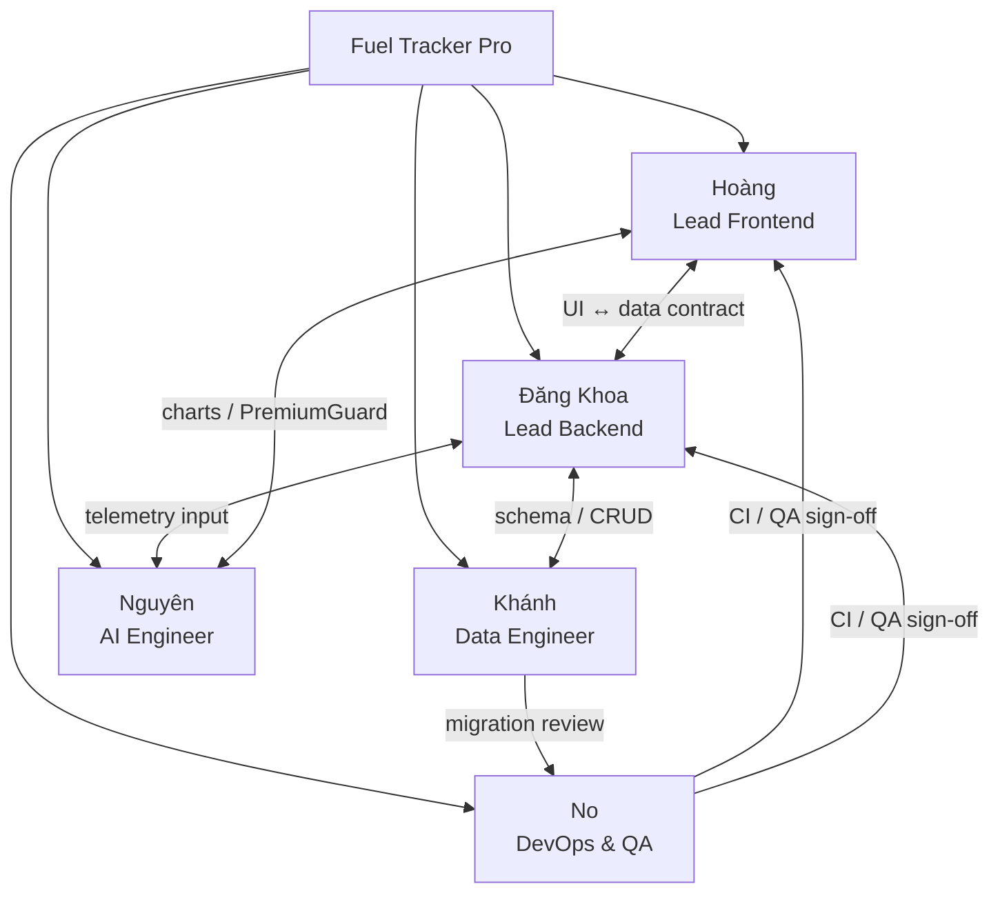
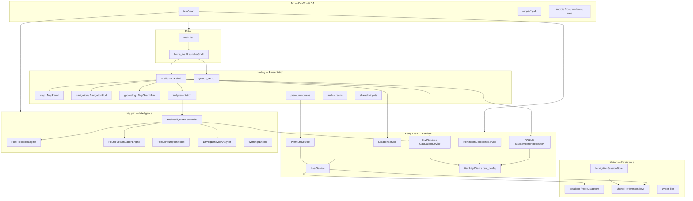

# TEAM_STRUCTURE.md — Cơ cấu team Fuel Tracker Pro

> Tài liệu onboarding và phân công dựa trên **source code thực tế** (`fuel_tracker_app` v2.0.0+1).  
> Dự án là **Flutter client** — không có backend server riêng; vai trò map theo trách nhiệm kỹ thuật tương đương.

**Quy mô code (2026-06-24):** 196 file Dart · ~31.566 dòng · 10 feature modules · 11 unit tests

---

## Đội ngũ

| Tên | Chức danh | Phạm vi ước tính |
|---|---|---|
| **Hoàng** | Lead Frontend | ~40% codebase (UI / UX) |
| **Đăng Khoa** | Lead Backend | ~30% (services / API / business logic) |
| **Khánh** | Data Engineer | ~10% (JSON / SharedPreferences / persistence) |
| **Nguyên** | AI Engineer | ~12% (fuel intelligence engines) |
| **No** | DevOps & QA | ~8% (build / scripts / test / CI) |

---

## Sơ đồ tổ chức team



### Luồng phối hợp chính

```
Hoàng (UI)  ←──contract──→  Đăng Khoa (services)
       ↑                           ↓
       └── PremiumGuard UX    Khánh (data.json / prefs)
Nguyên (engines) ──output──→ Hoàng (Fuel Intelligence UI)
No (test/build) ──gate──→ toàn team trước merge
```

---

## Sơ đồ phụ thuộc module (toàn dự án)



---

## Ma trận trách nhiệm (RACI)

**Chú thích:** R = Responsible (thực hiện) · A = Accountable (chịu trách nhiệm cuối) · C = Consulted (tham vấn) · I = Informed (được thông báo)

| Hạng mục / Module | Hoàng | Đăng Khoa | Khánh | Nguyên | No |
|---|---|---|---|---|---|
| **Launcher iOS** (`home_ios`) | R/A | C | I | I | C |
| **HomeShell orchestration UI** | R/A | C | I | C | C |
| **MapPanel / map styles** | R/A | C | I | I | I |
| **NavigationHud** | R/A | C | I | C | I |
| **MapSearchBar / geocoding UI** | R/A | C | I | I | I |
| **Auth / Register / Login UI** | R/A | C | C | I | C |
| **Premium UI / PremiumGuard** | R/A | C | C | I | C |
| **Fuel Intelligence screens** | R/A | C | I | C | C |
| **Profile / Account Drawer** | R/A | C | C | I | I |
| **Group3 Food Demo** | R/A | I | I | I | C |
| **Theme / animation tokens** | R/A | I | I | I | I |
| **OSRM routing service** | I | R/A | I | C | C |
| **Nominatim geocoding** | I | R/A | I | I | C |
| **LocationService / GPS** | C | R/A | I | C | C |
| **GasStation / Overpass** | I | R/A | I | I | C |
| **FuelService / route fuel** | C | R/A | C | C | C |
| **UserService / session logic** | C | R/A | C | I | I |
| **PremiumService (demo pay)** | C | R/A | C | I | I |
| **OsmHttp / osm_config** | I | R/A | I | I | C |
| **NotificationService** | I | R/A | I | I | C |
| **data.json schema** | I | C | R/A | I | C |
| **UserDataStore read/write** | I | C | R/A | I | C |
| **SharedPreferences keys** | I | C | R/A | I | I |
| **NavigationSessionStore** | I | C | R/A | I | C |
| **Avatar file storage** | C | C | R/A | I | I |
| **Fuel prediction engine** | I | C | I | R/A | C |
| **Route fuel simulation** | I | C | I | R/A | C |
| **Consumption / driving behavior** | I | C | I | R/A | C |
| **Warnings engine** | I | C | I | R/A | I |
| **FuelIntelligenceViewModel** | C | C | I | R/A | C |
| **Unit tests** (`test/`) | C | C | C | C | R/A |
| **Build đa nền tảng** | I | I | I | I | R/A |
| **Web LAN scripts** | I | C | I | I | R/A |
| **CI/CD** (chưa có — cần tạo) | I | I | I | I | R/A |
| **QA regression manual** | C | C | C | C | R/A |

---

# Hoàng — Lead Frontend

## Vai trò

Chịu trách nhiệm toàn bộ lớp presentation: widget, screen, animation, điều hướng UI, compose feature trên `HomeShell`, launcher iOS giả lập, và trải nghiệm người dùng end-to-end trên màn hình.

## Nhiệm vụ chính

1. Phát triển và bảo trì `HomeShell` (~2.539 dòng) — orchestration UI map + nav + fuel.
2. Launcher iOS (`LauncherShell`, Dynamic Island, Control Center, App Library).
3. Màn hình auth, premium, profile, account drawer.
4. Fuel Intelligence UI (biểu đồ, cards, PremiumGuard blur).
5. MapPanel, NavigationHud, MapSearchBar — tích hợp props từ services.
6. Refactor god-widget; đồng bộ design tokens (`core/theme/`, `ios_design_tokens`).
7. Phối hợp Đăng Khoa về loading/error states; phối hợp Nguyên về hiển thị prediction.

## Danh sách file phụ trách

| Nhóm | Đường dẫn |
|---|---|
| Shell | `lib/features/shell/screens/home_shell.dart`, `lib/features/shell/widgets/shell_bottom_nav.dart` |
| Map UI | `lib/features/map/presentation/widgets/map_panel.dart`, `lib/features/map/core/map_style.dart` |
| Navigation UI | `lib/features/navigation/presentation/widgets/navigation_hud.dart` |
| Geocoding UI | `lib/features/geocoding/presentation/widgets/map_search_bar.dart`, `place_suggestions_panel.dart` |
| Launcher iOS | `lib/features/home_ios/**` (toàn bộ `presentation/`, `core/`) |
| Auth UI | `lib/features/auth/screens/*.dart`, `lib/features/auth/widgets/**`, `lib/features/auth/navigation/auth_navigation.dart` |
| Premium UI | `lib/features/premium/screens/premium_screen.dart`, `lib/features/premium/widgets/**` |
| Fuel UI | `lib/features/fuel/presentation/screens/fuel_intelligence_screen.dart`, `presentation/widgets/**` |
| Shared UI | `lib/shared/screens/profile_settings_sheet.dart`, `lib/shared/screens/home_screen.dart`, `lib/shared/screens/security/**`, `lib/shared/widgets/**` |
| Group3 | `lib/features/group3_demo/**` |
| Theme | `lib/core/app_theme.dart`, `lib/core/theme/**`, `lib/core/ios_design_tokens.dart`, `lib/core/vehicle_ui_tokens.dart` |
| Entry chrome | `lib/main.dart` (phần `MaterialApp` builder, theme selector) |

## Module phụ trách

- `features/shell` (UI layer)
- `features/home_ios`
- `features/map` (presentation)
- `features/navigation` (presentation)
- `features/geocoding` (presentation)
- `features/auth` (screens/widgets)
- `features/premium` (screens/widgets)
- `features/fuel` (presentation)
- `features/group3_demo`
- `shared/screens`, `shared/widgets`
- `core/theme`, `core/app_theme.dart`

## Thứ tự học code

```
1. lib/main.dart
2. lib/features/home_ios/presentation/launcher_shell.dart
3. lib/features/home_ios/presentation/widgets/app_launch_overlay.dart
4. lib/shared/screens/home_screen.dart
5. lib/features/shell/screens/home_shell.dart  ← đọc theo section
6. lib/features/map/presentation/widgets/map_panel.dart
7. lib/features/navigation/presentation/widgets/navigation_hud.dart
8. lib/features/geocoding/presentation/widgets/map_search_bar.dart
9. lib/shared/widgets/account_drawer/account_drawer.dart
10. lib/features/auth/screens/login_screen.dart
11. lib/features/premium/widgets/premium_guard.dart
12. lib/features/fuel/presentation/screens/fuel_intelligence_screen.dart
```

## Checklist onboarding

- [ ] `flutter pub get` + `flutter run -d windows` thành công
- [ ] Mở Fuel Tracker từ launcher → search → bắt đầu navigation
- [ ] Mở tab Fuel Intelligence (user Premium trong `data.json`)
- [ ] Đăng nhập `admin@gmail.com` / `123456`
- [ ] Liệt kê 5 luồng `setState` chính trong `home_shell.dart`
- [ ] Phân biệt chỗ dùng Provider vs Riverpod
- [ ] Sửa 1 bug UI và pass `flutter analyze`

## Công việc hằng ngày

- Fix layout, theme, gesture bugs trên launcher và shell
- Review PR chạm `home_shell.dart`, `profile_settings_sheet.dart`
- Đồng bộ design tokens khi thêm component mới
- Kiểm tra PremiumGuard blur/lock UX

## Công việc hằng tuần

- Refactor ≥1 section `home_shell.dart` (mục tiêu −200 dòng/tuần)
- Widget test cho 1 screen (Login, PremiumGuard, MapSearchBar)
- Demo build Windows + Android cho team
- Sync với Đăng Khoa về API loading states

## Chức năng liên quan trực tiếp

| Chức năng | File chính |
|---|---|
| Launcher iOS giả | `launcher_shell.dart`, `ios_home_screen.dart` |
| Bản đồ realtime | `map_panel.dart`, `home_shell.dart` |
| Tìm kiếm địa điểm (UI) | `map_search_bar.dart`, `place_suggestions_panel.dart` |
| HUD chỉ đường | `navigation_hud.dart` |
| Tab Fuel Intelligence | `fuel_intelligence_screen.dart` |
| Đăng nhập / Đăng ký | `login_screen.dart`, `register_screen.dart` |
| Premium & khóa tính năng | `premium_guard.dart`, `premium_screen.dart` |
| Account Drawer / Profile | `account_drawer.dart`, `profile_settings_sheet.dart` |
| Group3 Food Demo | `group3_food_demo_screen.dart` |
| Khung iPhone desktop | `iphone_17_pro_max_frame.dart` |

## Cần phối hợp

| Thành viên | Nội dung phối hợp |
|---|---|
| **Đăng Khoa** | Contract dữ liệu services → UI; error/loading; wire `HomeShell` gọi repository |
| **Khánh** | Hiển thị `tripHistory`, avatar path, profile fields từ JSON |
| **Nguyên** | Bind prediction/simulation output vào Fuel Intelligence charts |
| **No** | Widget test, regression QA UI, build verification trước release |

**Mức độ khó:** 8/10

---

# Đăng Khoa — Lead Backend

## Vai trò

Chịu trách nhiệm services, repositories, business logic client-side, tích hợp API bên thứ ba (Nominatim, OSRM, Overpass, Open-Meteo), GPS pipeline, và orchestration logic mà `HomeShell` gọi tới.

> **Lưu ý:** Không có server backend trong repo — "Backend" = tầng service + domain logic trên thiết bị.

## Nhiệm vụ chính

1. OSRM routing, off-route reroute, navigation session logic.
2. Nominatim geocoding (search/reverse/lookup), rate limit.
3. `LocationService` — GPS stream, filter, tracking policy.
4. Fuel domain: `FuelService`, `GasStationService`, `RouteFuelService`, refuel flow logic.
5. `UserService`, `UserSessionService`, `PremiumService` — business rules.
6. `OsmHttpClient`, `osm_config`, retry/timeout.
7. `NotificationService` — cảnh báo xăng thấp.
8. Hỗ trợ Hoàng tách logic khỏi `home_shell.dart` sang controller/repository.

## Danh sách file phụ trách

| Nhóm | Đường dẫn |
|---|---|
| Navigation | `lib/features/navigation/data/**`, `lib/features/navigation/core/**` |
| Geocoding | `lib/features/geocoding/data/**`, `lib/features/geocoding/core/**` |
| Location | `lib/features/location/**` |
| Fuel services | `lib/features/fuel/data/services/*.dart`, `lib/features/fuel/data/models/*.dart` |
| Auth logic | `lib/features/auth/services/user_service.dart` |
| Premium logic | `lib/features/premium/services/premium_service.dart`, `premium_manager.dart` |
| Session | `lib/shared/services/user_session_service.dart` |
| Providers | `lib/shared/providers/app_providers.dart` |
| HTTP / Config | `lib/core/network/osm_http.dart`, `lib/core/config/osm_config.dart`, `constants.dart`, `lan_dev_config.dart` |
| Notifications | `lib/shared/services/notification_service.dart` |
| Avatar pick | `lib/shared/services/avatar_service.dart` |
| Guards | `lib/core/app_runtime_guard.dart`, `lib/core/refuel_debug_tools.dart` |
| iOS bridge data | `lib/features/home_ios/data/ios_system_bridge.dart` |

## Module phụ trách

- `features/navigation` (data + core)
- `features/geocoding` (data + core)
- `features/location`
- `features/fuel/data`
- `features/auth/services`
- `features/premium/services`
- `shared/services`, `shared/providers`
- `core/network`, `core/config`

## Thứ tự học code

```
1. lib/core/config/osm_config.dart
2. lib/core/network/osm_http.dart
3. lib/features/navigation/data/repositories/map_navigation_repository.dart
4. lib/features/navigation/data/services/osrm_routing_service.dart
5. lib/features/geocoding/data/services/nominatim_geocoding_service.dart
6. lib/features/location/data/services/location_service.dart
7. lib/features/fuel/data/services/fuel_service.dart
8. lib/features/fuel/data/services/gas_station_service.dart
9. lib/features/fuel/data/services/route_fuel_service.dart
10. lib/features/auth/services/user_service.dart
11. lib/shared/services/user_session_service.dart
12. lib/features/shell/screens/home_shell.dart (phần gọi services)
```

## Checklist onboarding

- [ ] Trace flow: search → OSRM → polyline (log HTTP)
- [ ] `flutter test test/osrm_routing_service_test.dart`
- [ ] `flutter test test/nominatim_geocoding_service_test.dart`
- [ ] Hiểu `NavigationSessionStore` save/load
- [ ] Hiểu `FuelService.consumeDistanceMeters`
- [ ] Cấu hình `OSM_DEV_PROXY` cho Web LAN
- [ ] Sửa 1 bug trong `gas_station_service` hoặc `route_off_route`

## Công việc hằng ngày

- Debug API 429/timeout/empty Overpass
- Review error handling trong services
- Hỗ trợ Hoàng về data shape và async states

## Công việc hằng tuần

- Unit test cho service đang sửa
- Đánh giá rate limit Nominatim/OSRM public
- Thiết kế tách `HomeShell` logic → repository/controller
- Phối hợp Khánh khi đổi schema user

## Chức năng liên quan trực tiếp

| Chức năng | File chính |
|---|---|
| Tính tuyến OSRM | `osrm_routing_service.dart` |
| Tìm địa điểm Nominatim | `nominatim_geocoding_service.dart` |
| GPS realtime | `location_service.dart` |
| Trạm xăng Overpass | `gas_station_service.dart` |
| Tiêu hao nhiên liệu GPS | `fuel_service.dart` |
| Phân tích xăng trên tuyến | `route_fuel_service.dart` |
| Off-route / reroute | `route_off_route.dart`, `gps_tracking_policy.dart` |
| Đăng nhập local | `user_service.dart`, `user_session_service.dart` |
| Premium demo activation | `premium_service.dart` |
| Khôi phục phiên nav | `navigation_session_store.dart` |
| Thời tiết Open-Meteo | `weather_service.dart` |

## Cần phối hợp

| Thành viên | Nội dung phối hợp |
|---|---|
| **Hoàng** | API contract UI; tách logic khỏi shell; HUD/refuel flow |
| **Khánh** | `UserService` CRUD ↔ `UserDataStore`; prefs keys mới |
| **Nguyên** | Input telemetry, route polyline cho engines; consumption defaults |
| **No** | Network-dependent tests; mock API cho CI; OSM proxy LAN |

**Mức độ khó:** 8/10

---

# Khánh — Data Engineer

## Vai trò

Chịu trách nhiệm schema dữ liệu local, persistence đa nền tảng (JSON file, SharedPreferences, avatar files), integrity/migration, và session blob navigation.

> **Lưu ý:** Không có SQL/ORM — vai trò = data modeling + local storage engineering.

## Nhiệm vụ chính

1. `UserDataStore` — đọc/ghi `data.json` (Web vs Native paths).
2. Schema `UserModel`, `TripHistoryEntry`, `UserFuelData`, `session`.
3. SharedPreferences keys: auth, dark mode, privacy, navigation session.
4. Avatar file `{documents}/avatars/{userId}.jpg`.
5. `NavigationSessionStore` — polyline/destination persist.
6. `TtlCache` — cache runtime (tham vấn Đăng Khoa).
7. Đề xuất migration khi schema đổi (`database_v2`).

## Danh sách file phụ trách

| Nhóm | Đường dẫn |
|---|---|
| User store | `lib/features/auth/data/user_data_store.dart` |
| Models | `lib/features/auth/models/user_model.dart`, `user_data_models.dart` |
| Seed | `assets/data/data.json` |
| Nav session | `lib/features/navigation/data/session/navigation_session_store.dart` |
| Prefs (auth) | `lib/shared/services/user_session_service.dart` (keys L26–28) |
| Prefs (privacy) | `lib/shared/screens/security/privacy_screen.dart` |
| Avatar paths | `lib/shared/services/avatar_service.dart`, paths trong `user_session_service.dart` |
| Cache util | `lib/core/ttl_cache.dart` |
| Fuel sync | `lib/features/fuel/data/services/fuel_service.dart` (`loadFromUserData`, `exportUserData`) |

## Module phụ trách

- `features/auth/data`
- `features/auth/models`
- `assets/data/data.json`
- `navigation/data/session`
- SharedPreferences layer (cross-cutting)
- Avatar file storage

## Thứ tự học code

```
1. assets/data/data.json
2. lib/features/auth/models/user_model.dart
3. lib/features/auth/models/user_data_models.dart
4. lib/features/auth/data/user_data_store.dart
5. lib/features/auth/services/user_service.dart
6. lib/shared/services/user_session_service.dart
7. lib/features/navigation/data/session/navigation_session_store.dart
8. lib/core/ttl_cache.dart
```

## Checklist onboarding

- [ ] Tìm file JSON active trên Windows (`UserDataStore.activeFilePath`)
- [ ] Đăng ký user mới → verify JSON cập nhật
- [ ] Hiểu Web dùng `fuel_tracker_user_database_v1` thay File
- [ ] Liệt kê đủ 8 SharedPreferences keys
- [ ] Kill app → restore navigation session
- [ ] Đề xuất thêm field `schemaVersion` vào JSON

## Công việc hằng ngày

- Kiểm tra parse errors / data corruption
- Review PR đổi model fields
- Đảm bảo `fromJson` backward compatible

## Công việc hằng tuần

- Thiết kế migration plan nếu schema đổi
- Audit prefs keys trùng lặp
- Benchmark JSON size với nhiều `tripHistory`
- Unit test `UserModel` round-trip

## Chức năng liên quan trực tiếp

| Chức năng | File / key |
|---|---|
| User database | `data.json`, `UserDataStore` |
| Session đăng nhập | `session.currentUserId` |
| Trip history (demo data) | `users[].tripHistory` |
| Fuel data per user | `users[].fuelData` |
| Premium flags | `premium`, `premiumPlan`, `premiumExpireAt` |
| Dark mode | `dark_mode_enabled` |
| Remember me | `auth_remember_me`, `auth_remember_email` |
| Navigation restore | `navigation_session_v1` |
| Privacy toggles | `privacy_share_analytics`, etc. |
| Avatar storage | `avatars/{userId}.jpg` |

## Cần phối hợp

| Thành viên | Nội dung phối hợp |
|---|---|
| **Đăng Khoa** | `UserService` CRUD; thêm field user; fuel sync |
| **Hoàng** | Hiển thị profile, trip history, avatar UI |
| **Nguyên** | Lưu prediction history (nếu implement sau) |
| **No** | Test data seed; backup/restore QA scenarios |

**Mức độ khó:** 5/10

---

# Nguyên — AI Engineer

## Vai trò

Chịu trách nhiệm các engine phân tích nhiên liệu local (`fuel/intelligence/`), aggregation trong `FuelIntelligenceViewModel`, và input data (weather, elevation, telemetry).

> **Lưu ý:** Không có LLM/chatbot trong code. `PremiumFeature.aiAssistant` chỉ là enum — chưa implement.

## Nhiệm vụ chính

1. `FuelPredictionEngine` — dự đoán range, thời điểm cần đổ.
2. `RouteFuelSimulationEngine` — mô phỏng tiêu hao dọc tuyến.
3. `FuelConsumptionModel` — hệ số L/100km theo hành vi.
4. `DrivingBehaviorAnalyzer` — gia tốc/phanh từ `sensors_plus`.
5. `WarningsEngine` — cảnh báo rule-based.
6. `FuelIntelligenceViewModel` — orchestrate engines + weather.
7. Tune `constants.dart` (ngưỡng bình, tiêu hao mặc định).
8. (Tương lai) Spec/implement `aiAssistant` nếu product yêu cầu.

## Danh sách file phụ trách

| Nhóm | Đường dẫn |
|---|---|
| Prediction | `lib/features/fuel/intelligence/prediction/**` |
| Simulation | `lib/features/fuel/intelligence/simulation/**` |
| Consumption | `lib/features/fuel/intelligence/consumption/**` |
| Driving behavior | `lib/features/fuel/intelligence/driving_behavior/**` |
| Warnings | `lib/features/fuel/intelligence/warnings/**` |
| Telemetry | `lib/features/fuel/intelligence/telemetry/**` |
| ViewModel | `lib/features/fuel/presentation/viewmodels/fuel_intelligence_view_model.dart` |
| Input services | `lib/features/fuel/data/services/weather_service.dart`, `elevation_service.dart` |
| Analysis | `lib/features/fuel/data/services/route_fuel_service.dart` |
| Premium enum | `lib/features/premium/premium_manager.dart` (`aiAssistant`) |
| Defaults | `lib/core/config/constants.dart` |

## Module phụ trách

- `features/fuel/intelligence/**`
- `features/fuel/presentation/viewmodels/`
- `fuel/data/services/weather_service.dart`, `elevation_service.dart`
- `fuel/data/services/route_fuel_service.dart` (phối hợp Đăng Khoa)

## Thứ tự học code

```
1. lib/core/config/constants.dart
2. lib/features/fuel/intelligence/consumption/fuel_consumption_model.dart
3. lib/features/fuel/data/services/route_fuel_service.dart
4. lib/features/fuel/intelligence/prediction/fuel_prediction_engine.dart
5. lib/features/fuel/intelligence/simulation/route_fuel_simulation_engine.dart
6. lib/features/fuel/intelligence/driving_behavior/driving_behavior_analyzer.dart
7. lib/features/fuel/intelligence/warnings/**
8. lib/features/fuel/presentation/viewmodels/fuel_intelligence_view_model.dart
9. lib/features/fuel/presentation/screens/fuel_intelligence_screen.dart (output)
10. lib/features/shell/screens/home_shell.dart (refuel flow)
```

## Checklist onboarding

- [ ] Giải thích `RouteFuelAnalysis` output fields
- [ ] Chạy Fuel Intelligence, đọc prediction card
- [ ] Trace `DrivingBehaviorAnalyzer` ← `sensors_plus`
- [ ] Xác nhận `PremiumFeature.aiAssistant` chưa có UI
- [ ] Viết unit test `fuel_consumption_model`
- [ ] Đề xuất 1 cải tiến prediction có metric đo được

## Công việc hằng ngày

- Tune consumption factors / thresholds
- Validate prediction vs GPS trips thực tế
- Review sensor data quality

## Công việc hằng tuần

- Calibrate model (nếu có dataset)
- Bật `openElevationLookupUrl` hoặc document fallback
- Unit test prediction edge cases
- Sync với Hoàng về chart UX

## Chức năng liên quan trực tiếp

| Chức năng | File chính |
|---|---|
| Dự đoán nhiên liệu | `fuel_prediction_engine.dart` |
| Mô phỏng tuyến | `route_fuel_simulation_engine.dart` |
| Model tiêu hao | `fuel_consumption_model.dart` |
| Phân tích lái xe | `driving_behavior_analyzer.dart` |
| Cảnh báo xăng | `warnings/` |
| Card thời tiết | `weather_service.dart` + `fuel_weather_card.dart` |
| Biểu đồ tiêu hao | `fuel_consumption_graph.dart` |
| Premium "AI" label | `premium_manager.dart` (enum only) |

## Cần phối hợp

| Thành viên | Nội dung phối hợp |
|---|---|
| **Đăng Khoa** | Polyline OSRM, `FuelService` mileage, `RouteFuelService` |
| **Hoàng** | Charts, PremiumGuard, Fuel Intelligence layout |
| **Khánh** | Lưu prediction history / trip analytics (future) |
| **No** | Unit test engines; benchmark performance |

**Mức độ khó:** 7/10

---

# No — DevOps & QA

## Vai trò

Chịu trách nhiệm build đa nền tảng, scripts dev (Web LAN), chất lượng phần mềm (unit test, manual QA), thiết lập CI/CD (hiện **chưa có** trong repo), và release gate trước merge.

## Nhiệm vụ chính

1. Duy trì `flutter test` + `flutter analyze` — 11 unit tests hiện có.
2. Build matrix: Windows, Android, Web.
3. Scripts LAN: `scripts/run_web_lan.ps1`, `fix_lan_firewall.ps1`, `config/lan_web.json`.
4. CORS proxy dev: `lan_dev_config.dart`, `tool/dev_cors_proxy.dart`.
5. Tạo GitHub Actions workflow (greenfield).
6. QA regression: login, navigation, fuel warning, premium guard.
7. Document permissions (location, notification, camera).
8. `flutter doctor` / platform toolchain health.

## Danh sách file phụ trách

| Nhóm | Đường dẫn |
|---|---|
| Package | `pubspec.yaml`, `analysis_options.yaml` |
| Tests | `test/*.dart` (11 files) |
| Scripts | `scripts/*.ps1`, `scripts/*.sh`, `tool/*.ps1` |
| LAN docs | `docs/LAN_ACCESS_VI.md`, `docs/LAN_ACCESS.md` |
| Web config | `config/lan_web.json`, `web/manifest.json` |
| Runtime | `lib/core/web_lan_runtime.dart`, `lib/core/config/lan_dev_config.dart` |
| Guards | `lib/core/app_runtime_guard.dart`, `author_integrity_guard.dart` |
| Platforms | `android/`, `ios/`, `windows/`, `web/` |
| Debug overlay | `lib/shared/widgets/web_lan_debug_overlay.dart` |

## Module phụ trách

- `test/` (toàn bộ)
- `scripts/`, `tool/`, `config/`
- `docs/LAN_ACCESS*.md`
- Platform runners (build config)
- CI/CD (cần tạo `.github/workflows/`)

## Thứ tự học code

```
1. pubspec.yaml
2. analysis_options.yaml
3. flutter test (chạy toàn bộ test/)
4. scripts/run_web_lan.ps1
5. docs/LAN_ACCESS_VI.md
6. lib/core/config/lan_dev_config.dart
7. android/app/build.gradle, windows/CMakeLists.txt
8. Đề xuất .github/workflows/flutter.yml
```

## Checklist onboarding

- [ ] `flutter doctor` pass
- [ ] `flutter test` — document network flaky tests
- [ ] `flutter build windows` thành công
- [ ] Chạy `scripts/run_web_lan.ps1`, mở URL trên điện thoại
- [ ] Liệt kê platform permissions
- [ ] Tạo draft CI workflow
- [ ] Viết QA checklist 20 cases (nav + fuel + auth)

## Công việc hằng ngày

- Chạy `flutter test` + `flutter analyze` trước merge
- Manual smoke test 1 platform
- Theo dõi build failures

## Công việc hằng tuần

- Thiết lập/cập nhật GitHub Actions
- Build matrix report (windows/android/web)
- Regression checklist sau sprint
- Báo cáo flaky tests (API network-dependent)

## Chức năng liên quan trực tiếp

| Chức năng | File / lệnh |
|---|---|
| Unit tests | `test/polyline_utils_test.dart`, `osrm_routing_service_test.dart`, … |
| Web LAN dev | `scripts/run_web_lan.ps1` |
| Author guard test | `test/author_integrity_test.dart` |
| Lint rules | `analysis_options.yaml` |
| Multi-platform build | `flutter build apk/windows/web` |
| Debug Web overlay | `web_lan_debug_overlay.dart` |

## Cần phối hợp

| Thành viên | Nội dung phối hợp |
|---|---|
| **Hoàng** | Widget test, UI regression, golden tests |
| **Đăng Khoa** | Mock HTTP cho CI; OSM proxy |
| **Khánh** | Test fixtures `data.json`; seed data QA |
| **Nguyên** | Engine unit tests; performance benchmark |

**Mức độ khó:** 6/10

---

## Ma trận phối hợp theo chức năng

| Chức năng end-to-end | R (chính) | A (phụ trách) | C | I |
|---|---|---|---|---|
| Mở app → Launcher → Fuel Tracker | Hoàng | Hoàng | Đăng Khoa | No |
| Search → Navigate (OSRM) | Đăng Khoa | Đăng Khoa | Hoàng | Khánh, No |
| GPS → trừ xăng → cảnh báo | Đăng Khoa | Đăng Khoa | Nguyên | Hoàng, No |
| Fuel Intelligence tab | Hoàng | Hoàng | Nguyên | Đăng Khoa, No |
| Đăng nhập / đăng ký | Đăng Khoa | Đăng Khoa | Hoàng, Khánh | No |
| Premium mua demo | Đăng Khoa | Đăng Khoa | Hoàng, Khánh | No |
| Trip History | Hoàng | Hoàng | Khánh | No |
| Khôi phục navigation session | Khánh | Khánh | Đăng Khoa | Hoàng |
| Web LAN deploy | No | No | Đăng Khoa | Hoàng |

---

## Daily standup — ai báo gì

| Thành viên | Báo cáo |
|---|---|
| **Hoàng** | UI bugs, shell refactor, launcher gestures |
| **Đăng Khoa** | API errors, service changes, off-route issues |
| **Khánh** | Schema/prefs changes, data integrity |
| **Nguyên** | Model accuracy, intelligence bugs |
| **No** | Test results, build status, CI progress |

---

## Code ownership — ai review PR nào

| Thay đổi | Owner | Reviewer bắt buộc |
|---|---|---|
| `home_shell.dart` UI | Hoàng | Đăng Khoa |
| `home_shell.dart` service calls | Đăng Khoa | Hoàng |
| `user_model.dart` / `data.json` | Khánh | Đăng Khoa |
| `fuel_prediction_engine.dart` | Nguyên | Đăng Khoa |
| `pubspec.yaml` / CI | No | Đăng Khoa |
| `osm_config.dart` | Đăng Khoa | No |

---

## Git workflow

```
main
  └── feature/<tên>-<mô-tả-ngắn>
```

Ví dụ:

- `feature/hoang-shell-refactor-nav`
- `feature/dangkhoa-overpass-retry`
- `feature/khanh-schema-v2`
- `feature/nguyen-prediction-tune`
- `feature/no-github-actions`

---

## Tài khoản demo QA

| Email | Password | Premium | Dùng cho |
|---|---|---|---|
| `admin@gmail.com` | `123456` | Có (yearly) | Full feature test |
| `hihi@gmail.com` | `123456` | Có (yearly) | Fuel data test |

OTP quên mật khẩu demo: `123456` (`UserSessionService.mockOtp`)

---

## Tài liệu liên quan

- [README.md](README.md) — Tài liệu hệ thống
- [PROJECT_ANALYSIS.md](PROJECT_ANALYSIS.md) — Phân tích kỹ thuật
- [docs/LAN_ACCESS_VI.md](docs/LAN_ACCESS_VI.md) — Web LAN (No)

---

*Cập nhật: 2026-06-24 — team: Hoàng, Đăng Khoa, Khánh, Nguyên, No.*
